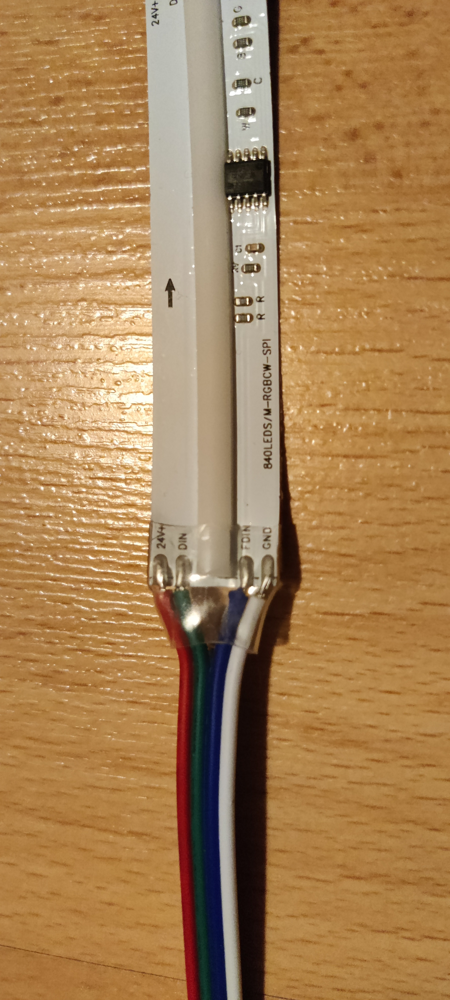
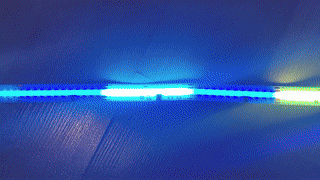
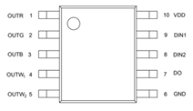
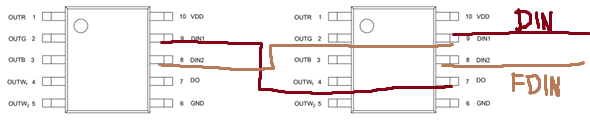
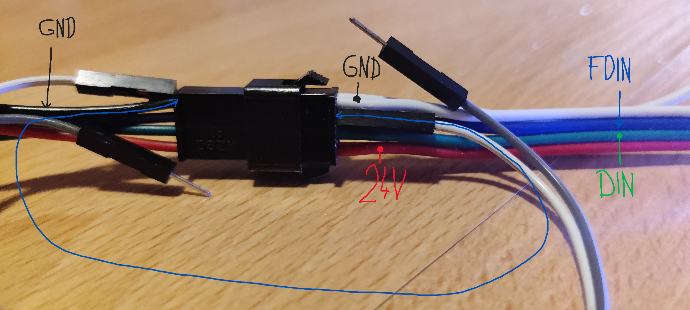
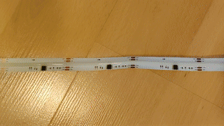

# WS2805-blinking-fix
How to wire WS2805 led strip (led strip with DIN &amp; FDIN)

Do you think the led strip does not work because of a bad contact? Did you finaly moved it and it seems to work only for you to breathe out or look at the light strip funny and it start flashing random colors again?

**TLDR: Ground FDIN** (or connect it to DIN? - just don't leave it [floating](#floating))

I recently bought aa RGB+CCT COB led strip and thought it arrived broken as some segments were blinking randomly (1st, 3rd, sometimes 5th, sometimes more of them) or were lit in white only.

I tried moving the led strip or the cables to get a better contact and when it seemed like the strip works, it broke after a few seconds and started blinking again.

## The LED strip:
`RGB+CCT COB LED`, `SPI RGBCCT`, `SPI RGB+W`, `FDIN/DIN`, `WS2805`(14 strings per meter, 12 LEDs in string - 12 LEDs each 71.42mm)

## The problem:
This is supposed to be blinking/fade off with single random color (look at [FIXed LED strip](#the-fixed-led-strip) for the original effect)

## DIN, FDIN

The WS2805 datasheet lists `DIN1` & `DIN1` as data 1 & 2 input. I did not find in the datasheet the function of data2 but I read somewhere that it acts as a backup data channel if the data 1 breaks and is wired like so (if I remember correctly):

It's nice as if the one WS2805 breaks the second data channel takes over... Unless you have floating (ungrounded) FDIN (=DIN2) and there is some noise on the FDIN and at the same time you are not receiving data on DIN (=DIN1) as the chip might think DIN data is broken and it accepts DIN2 data? Therefore it reads a bunch of noise/junk.

**The solution is easy - ground the FDIN!!!** (Or you can tie FDIN to DIN?)

## The FIXed LED strip
Connect the `FDIN` to `GND`/`DIN`:

And this is the result:

## Definition of floating pin:
Taken from [analog devices web](https://www.analog.com/en/resources/glossary/floating.html):

### Floating
1. A signal line is said to be "floating" if it is not connected to any voltage supply, ground, or ground-referenced signal source.
Examples:

- An open-drain, high-impedance (hi-z) output when in the off (hi-z) mode
- In microcomputer systems, a data or address bus may, at times, be undriven (floating). This is permissible because control signals indicate when data is valid, so users of the bus know when the signal can be ignored.

2. One form of non-volatile memory device is achieved via floating gates. The gate of a MOSFET has no connection, allowing charge to remain indefinitely. The gate charge is changed using Fowler-Nordheim tunneling or hot-carrier injection. EPROM, EEPROM, and flash